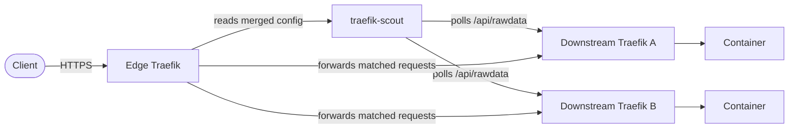

# traefik-scout

[](https://github.com/gringolito/traefik-scout/actions/workflows/ci.yaml)
[](https://github.com/gringolito/traefik-scout/actions/workflows/github-code-scanning/codeql)
[](https://codecov.io/gh/gringolito/traefik-scout/branch/main/graph/badge.svg)

Traefik Scout discovers and advertises downstream routes to an upstream Traefik.

## The problem

When infrastructure spans multiple Docker hosts or Kubernetes clusters, Traefik runs independently on
each one. A single public edge can sit in front of them, providing one wildcard DNS record, one
certificate, and centralized TLS termination.

The edge Traefik cannot discover routes from multiple remote Docker daemons because Traefik allows
only one `docker` provider per static configuration.

## Edge and downstream

The **edge** is the single publicly reachable Traefik instance. It terminates TLS, owns the wildcard
certificate, and handles all inbound client traffic.

A **downstream** is an independent Traefik instance behind the edge. Each downstream watches its own
Docker daemon or Kubernetes cluster and builds its routes from container labels.



traefik-scout runs alongside the edge. It polls each downstream, then exposes the merged routes to the
edge as a Traefik `http` provider. When a request matches a route, the edge forwards it to the
downstream that owns it. That downstream then applies its own middlewares and forwards the request
to the container.

## How it works

It polls each downstream Traefik on a fixed interval for its known routes. It filters out disabled
routers, internal entrypoints, and Traefik's own API. It then rewrites the remaining public routes
so the edge can reach them. Routes from each downstream are grouped under a unique name, so two
hosts can define routers with the same name without collisions.

traefik-scout merges these routes into a single table and serves it over plain HTTP in the format
expected by Traefik's `http` provider. The edge requires no translation.

Downstreams operate independently. A slow or unreachable host does not block routes from a healthy
one. An idle downstream returns an empty list. Traffic still passes through the downstream Traefik,
so its middlewares, load balancing, and TLS termination continue to apply there.

Routes appear at the edge within one poll interval. Removing a container's labels removes its routes
on the next poll.

## Why not the alternatives

**Redis-backed agents.** Tools like `traefik-kop` run an agent on each Docker host. The agent pushes
label-based configuration to a shared Redis instance, and the edge reads it from Redis. This requires
every host to initiate an outbound connection. A pull-based version would require exposing each host's
Docker API. The Docker API grants root-level access, while Traefik's API exposes routing information
instead.

**Traefik Enterprise.** The official Traefik provider requires a paid license and a licensing endpoint.
It uses a closed Raft-based control plane.

**Traefik Hub Multi-Cluster.** This is the successor to the Enterprise provider and is currently in
early access. It requires active licenses on both the edge and all downstreams.

## Quickstart

Copy the reference configuration and edit the downstreams:

```sh
cp config.example.yaml config.yaml
```

Run traefik-scout beside the edge Traefik with Docker Compose:

```yaml
services:
  traefik-scout:
    image: gringolito/traefik-scout:vX.Y.Z # pin to a released tag
    restart: unless-stopped
    volumes:
      - ./config.yaml:/etc/traefik-scout/config.yaml:ro
    environment:
      CONFIG_PATH: /etc/traefik-scout/config.yaml

  edge:
    image: traefik:v3
    restart: unless-stopped
    depends_on:
      - traefik-scout
    command:
      - --entrypoints.websecure.address=:443
      - --providers.http.endpoint=http://traefik-scout:8080/config
    ports:
      - "443:443"
```

This example leaves `websecure` without a certificate resolver, so Traefik
serves its own self-signed certificate; configure ACME or your wildcard
certificate on that entrypoint for real TLS.

`traefik-scout` does not need a published port. Only the edge needs to be exposed to the host.
Both services only need to communicate over a Docker Compose network.

Routes appear at the edge within one poll interval, which defaults to `30s`. See
[config.example.yaml](config.example.yaml) for the complete schema, including defaults. The example
loads directly with the real config loader and is covered by the test suite.

### Building from source

```sh
go build -o traefik-scout ./cmd/traefik-scout
./traefik-scout -config config.yaml
```

The `-config` flag and `CONFIG_PATH` environment variable are equivalent. The flag takes precedence
when both are set.
